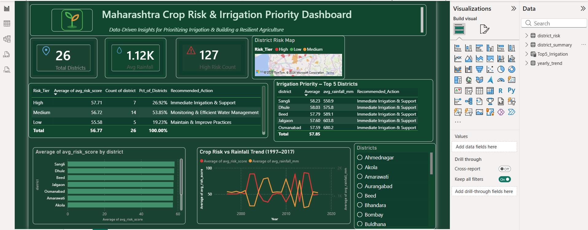
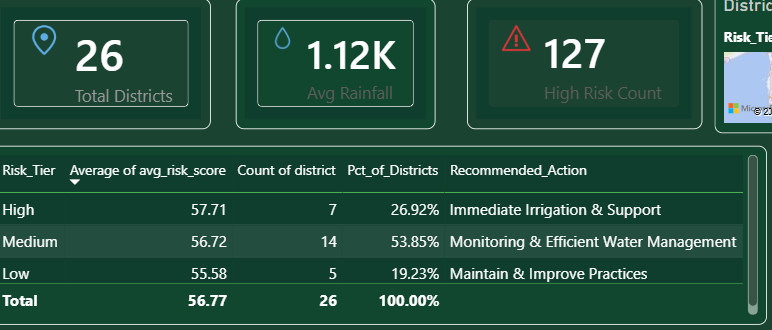
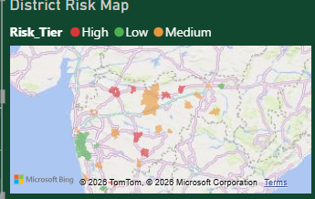
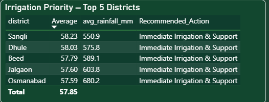
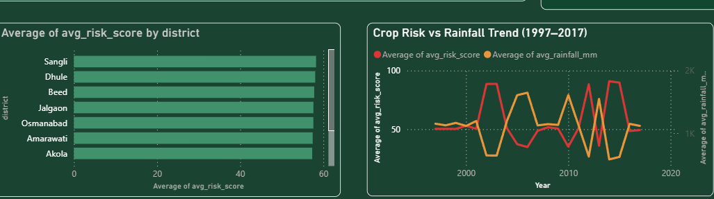

# 🌾 Maharashtra Crop Risk & Irrigation Priority Dashboard

**Data-driven insights for prioritizing irrigation and building a resilient agriculture system across Maharashtra.**



---

## 📌 Problem Statement

Maharashtra faces recurring drought and crop-risk challenges across its 26 districts, but irrigation resources are limited and need to be prioritized where they matter most. This dashboard analyzes **21 years of historical data (1997–2017)** to identify which districts are at the highest crop risk and require immediate irrigation support — turning raw agricultural and rainfall data into a clear, actionable priority list for policymakers and planners.

## 🎯 Objective

- Quantify crop risk at the district level using a custom **Risk Score** and **Risk Tier** classification (High / Medium / Low)
- Correlate crop risk trends against rainfall patterns over two decades
- Rank districts by irrigation priority to guide resource allocation
- Present findings in a clean, decision-ready Power BI dashboard

---

## 🛠️ Tech Stack

| Layer | Tools Used |
|---|---|
| **Data Processing** | Python (Pandas, NumPy) — data cleaning, risk scoring logic |
| **Database** | SQLite — structured storage across 3 relational tables |
| **Connectivity** | ODBC connection from SQLite to Power BI |
| **Visualization** | Power BI Desktop — DAX measures, custom theming, interactive visuals |

## 🗄️ Data Model

The SQLite database (`crop_risk.db`) contains three core tables:

- **`district_risk`** — district-level risk scores and classifications
- **`district_summary`** — aggregated summary stats per district
- **`yearly_trend`** — year-wise rainfall and risk data (1997–2017) for trend analysis

**Coverage:** 26 districts of Maharashtra × 21 years of data

---

## 📊 Dashboard Features

### 1. KPI Overview
Quick-glance cards showing Total Districts (26), Average Rainfall (1.12K mm), and High Risk District Count (127 records).



### 2. District Risk Map
An interactive Bing map plotting every district, color-coded by Risk Tier (High/Medium/Low), for instant geographic pattern recognition.



### 3. Irrigation Priority — Top 5 Districts
Built using DAX `TOPN`, this table surfaces the 5 districts most urgently needing irrigation intervention, ranked by average risk score.



### 4. Risk vs Rainfall Trend Analysis
Year-over-year comparison (1997–2017) of average risk score against average rainfall, alongside a district-wise risk score comparison — revealing how rainfall volatility correlates with crop risk over time.



---

## 🧮 Key DAX Measures

- **`Risk_Tier`** — calculated column classifying districts into High / Medium / Low based on data-driven thresholds (57.2 / 56.0)
- **`Pct_of_Districts`** — percentage share of districts in each risk tier
- **`Recommended_Action`** — conditional text measure mapping each risk tier to a concrete action (e.g., *"Immediate Irrigation & Support"*, *"Monitoring & Efficient Water Management"*, *"Maintain & Improve Practices"*)
- **Top 5 Irrigation Priority** — `TOPN()` DAX pattern ranking districts by average risk score

## 📈 Key Insight

| Risk Tier | Districts | % of Total | Recommended Action |
|---|---|---|---|
| **High** | 7 | 26.92% | Immediate Irrigation & Support |
| **Medium** | 14 | 53.85% | Monitoring & Efficient Water Management |
| **Low** | 5 | 19.23% | Maintain & Improve Practices |

Districts like **Sangli, Dhule, Beed, Jalgaon, and Osmanabad** emerge as the top irrigation priority zones, each averaging a risk score above 57.5.

---

## 📁 Repository Structure

```
crop-risk-dashboard/
│
├── README.md
├── .gitignore
├── database/
│   └── maharashtra_crop_risk.db        ← final SQLite DB (connected to Power BI via ODBC)
├── data/
│   ├── raw_data/
│   │   ├── ICRISAT-District_Level_Data.csv
│   │   └── rainfall_maharashtra.csv
│   └── cleaned_data/
│       └── final_risk_data.csv
├── screenshots/
│   ├── 01_dashboard_full_overview.png
│   ├── 02_district_risk_map.png
│   ├── 03_kpi_cards_risk_summary.png
│   ├── 04_irrigation_priority_top5.png
│   └── 05_district_trend_charts.png
└── scripts/
    ├── 01_clean_merge.py       ← cleans & merges crop + rainfall data, calculates Crop_Risk_Score
    └── 02_load_to_sqlite.py    ← loads cleaned data into SQLite (3 tables)
```

## 🔄 End-to-End Pipeline

```
raw_data/ (ICRISAT crop data + rainfall data)
        │
        ▼
01_clean_merge.py   →  merges datasets, calculates Crop_Risk_Score & Risk_Category
        │
        ▼
data/cleaned_data/final_risk_data.csv
        │
        ▼
02_load_to_sqlite.py  →  builds 3 tables in SQLite
        │
        ▼
database/maharashtra_crop_risk.db  (district_risk, district_summary, yearly_trend)
        │
        ▼
Power BI (ODBC connection)  →  Interactive dashboard (see screenshots below)
```

**Risk Score formula:** `Crop_Risk_Score = (Rainfall Deviation × 40%) + (Yield Deviation × 40%) + (Drought Flag × 20%)`, scaled 0–100.

## 🚀 How to Explore This Project

**View the dashboard:** Browse the `screenshots/` folder above for a full visual walkthrough of every page (overview, risk map, KPI summary, irrigation priority table, trend charts).

**Reproduce the data pipeline:**
```bash
# 1. Clone the repo
git clone <your-repo-url>
cd crop-risk-dashboard

# 2. Install dependencies
pip install pandas numpy

# 3. Run the cleaning & merging script
python scripts/01_clean_merge.py

# 4. Load into SQLite
python scripts/02_load_to_sqlite.py

# 5. Connect the resulting database/maharashtra_crop_risk.db to Power BI Desktop
#    via ODBC to rebuild the dashboard visuals
```

> The finished `.pbix` file isn't included in this repo — the underlying database, full data pipeline, and dashboard screenshots above capture the complete project end-to-end.

---

## 🔮 Future Improvements

- Extend dataset beyond 2017 with more recent rainfall/crop data
- Add crop-type-specific risk modeling (not just aggregate risk)
- Deploy as a Power BI Service report with scheduled refresh
- Add a Python-based forecasting layer (e.g., risk score prediction for upcoming seasons)

---

## 👤 Author

**Kamlesh Mhaske**
Final-year BCS Student | Aspiring Data Analyst
📍 Aurangabad (Chhatrapati Sambhajinagar), Maharashtra

*Feel free to connect on LinkedIn or reach out with feedback/suggestions!*
